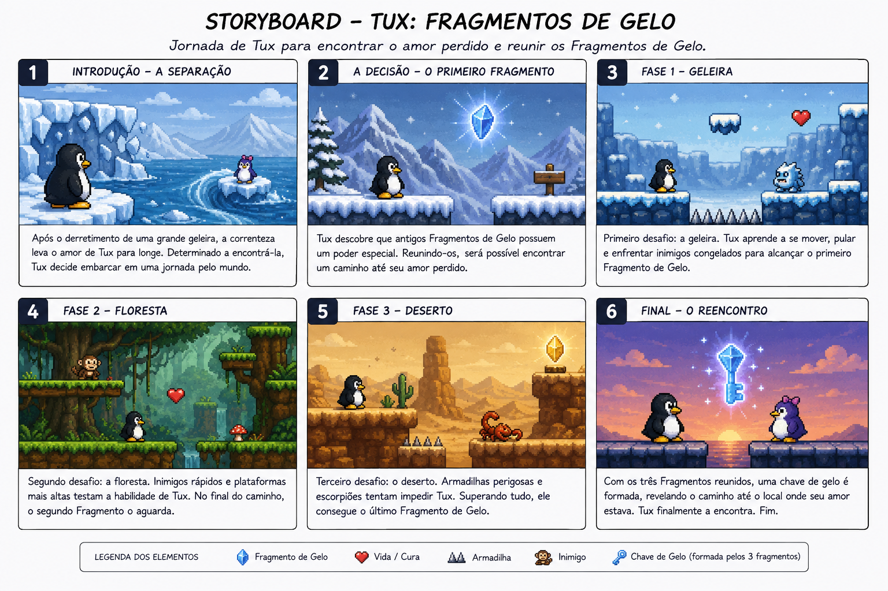

# 🐧 Tux: Fragmentos de Gelo

**Uma aventura gelada de coragem e reencontro**

---

## 📌 Descrição Geral

**Tux: Fragmentos de Gelo** é um jogo 2D dos gêneros **plataforma, aventura e ação**, desenvolvido utilizando a biblioteca **Pygame**.

O jogador controla **Tux**, um pinguim inspirado no mascote do GNU/Linux, em uma jornada por diferentes cenários para encontrar seu amor perdido após um desastre natural.

O jogo possui progressão linear, combate simples, obstáculos de plataforma e coleta de itens especiais.

A duração estimada do jogo é de **3 a 5 minutos**.

---

## 🎯 Objetivo do Jogo

O objetivo principal é controlar Tux através de **3 fases**, superando inimigos e obstáculos até coletar todos os **Fragmentos de Gelo**.

Ao reunir os **3 fragmentos**, uma chave especial é formada, desbloqueando o caminho até o local onde o amor perdido de Tux está.

### Condição de vitória:

* Completar as 3 fases
* Coletar os 3 Fragmentos de Gelo
* Encontrar o amor perdido de Tux

---

## 📖 História do Jogo

Após o derretimento de uma antiga geleira, uma forte corrente marítima separa Tux de seu grande amor.

Sem saber para onde ela foi levada, Tux encontra uma antiga lenda sobre os **Fragmentos de Gelo**, artefatos mágicos capazes de revelar caminhos perdidos.

Determinado a reencontrá-la, Tux inicia uma jornada atravessando diferentes regiões, enfrentando obstáculos e perigos até reunir os fragmentos necessários para encontrá-la novamente.

---

## 🐧 Personagem Principal

O personagem principal do jogo é **Tux**, um pinguim aventureiro inspirado no mascote do sistema GNU/Linux.

### Movimentação

* Andar para esquerda (**A**)
* Andar para direita (**D**)
* Pular (**Espaço**)
* Dash (**Q**)

### Ações

* Ataque básico (**J**)

### Atributos

* ❤️ Vida: 3 corações
* ⚡ Velocidade
* 🏆 Pontuação
* 🛡️ Invencibilidade temporária após dano

---

## 👾 Inimigos e Obstáculos

Cada fase possui inimigos inspirados no ambiente visitado.

### Fase 1 — Geleira

**Inimigos:**

* Criaturas congeladas

**Comportamento:**

* Movimento automático simples

---

### Fase 2 — Floresta

**Inimigos:**

* Macacos

**Comportamento:**

* Movimento rápido entre plataformas

---

### Fase 3 — Deserto

**Inimigos:**

* Escorpiões

**Comportamento:**

* Movimento terrestre lento

---

### Obstáculos

* Buracos
* Espinhos
* Plataformas elevadas
* Trechos de parkour simples

### Interações

Ao encostar em inimigos ou armadilhas:

* O jogador perde vida
* Sofre knockback
* Recebe invencibilidade temporária

Ao atacar inimigos:

* Eles recebem dano
* Podem ser derrotados

---

## 🗺️ Cenário (Mapa)

O jogo possui mapas 2D lineares, com progressão da esquerda para a direita.

### Fase 1 — Geleira

Mapa introdutório com obstáculos simples.

### Fase 2 — Floresta

Mapa com mais plataformas e verticalidade.

### Fase 3 — Deserto

Mapa com armadilhas e maior dificuldade.

No final de cada fase está localizado um **Fragmento de Gelo**, necessário para progressão do jogo.

---

## 🏆 Sistema de Pontuação

O jogador ganha pontos ao:

| Ação             | Pontos |
| ---------------- | ------ |
| Derrotar inimigo | 10     |
| Completar fase   | 50     |
| Finalizar jogo   | Bônus  |

Pontuação máxima aproximada:

**100 pontos por fase**

---

## ❤️ Sistema de Vida

O jogador inicia o jogo com:

**❤️❤️❤️ (3 vidas)**

### O jogador perde vida ao:

* Encostar em inimigos
* Cair em armadilhas
* Cair em buracos

### Quando as vidas acabam:

* Tela de **Game Over**
* Reinício da fase atual

Itens de cura podem aparecer durante as fases.

---

## 🎮 Controles

| Tecla      | Função              |
| ---------- | ------------------- |
| **A**      | Andar para esquerda |
| **D**      | Andar para direita  |
| **Espaço** | Pular               |
| **Q**      | Dash                |
| **J**      | Ataque básico       |
| **ESC**    | Menu de pausa       |

---

## 🔄 Fluxo do Jogo

### Início

1. Tela de abertura
2. Menu principal
3. Botão **Jogar**

### Durante o jogo

* O jogador atravessa as fases
* Enfrenta inimigos
* Supera obstáculos
* Coleta Fragmentos de Gelo

### Vitória

* Coleta os 3 fragmentos
* Libera o caminho final
* Tux reencontra seu amor perdido

### Derrota

* Todas as vidas acabam
* Tela de Game Over
* Reinício da fase

---

## 📜 Regras do Jogo

* O jogador não pode atravessar paredes
* Não é possível sair dos limites do mapa
* O fragmento deve ser coletado para concluir a fase
* Colisão com inimigos causa dano
* Cair em buracos remove uma vida
* O jogador possui invencibilidade temporária após sofrer dano

---

## 📁 Estrutura do Projeto

```txt
tux-fragmentos-de-gelo/
│── assets/
│   ├── player/
│   ├── enemies/
│   ├── backgrounds/
│   ├── sounds/
│
│── main.py
│── player.py
│── enemy.py
│── map.py
│── ui.py
│── config.py
│── utils.py
│
│── README.md
│── requirements.txt
```

### Responsabilidades dos Arquivos

| Arquivo     | Responsabilidade             |
| ----------- | ---------------------------- |
| `main.py`   | Execução principal do jogo   |
| `player.py` | Classe do jogador            |
| `enemy.py`  | Comportamento dos inimigos   |
| `map.py`    | Sistema de mapas             |
| `ui.py`     | Interface (vida e pontuação) |
| `config.py` | Configurações gerais         |
| `utils.py`  | Funções auxiliares           |

---

## ✅ Funcionalidades Mínimas

A primeira versão do jogo deverá conter obrigatoriamente:

* Movimentação do personagem
* Sistema de pulo
* Dash
* Ataque básico
* Sistema de vida
* Pelo menos 1 fase funcional
* Inimigos funcionando
* Tela de vitória ou derrota

---

## 🚀 Melhorias Futuras

* Pulo duplo
* Ataque especial
* Mais continentes
* Chefes (Bosses)
* Ranking de pontuação
* Sistema de energia
* Checkpoints
* Melhorias visuais
* Sons e trilha sonora
* Mais animações

---

## 🖼️ Storyboard do Jogo

O storyboard abaixo representa visualmente a jornada de Tux, desde a separação causada pelo desastre natural até o reencontro final.

<p align="center">
  
</p>

### Principais Cenas
- ❄️ Separação de Tux e seu amor  
- 🧊 Descoberta dos Fragmentos de Gelo  
- 🏔️ Fase da Geleira  
- 🌳 Fase da Floresta  
- 🏜️ Fase do Deserto  
- 💙 Reencontro final
